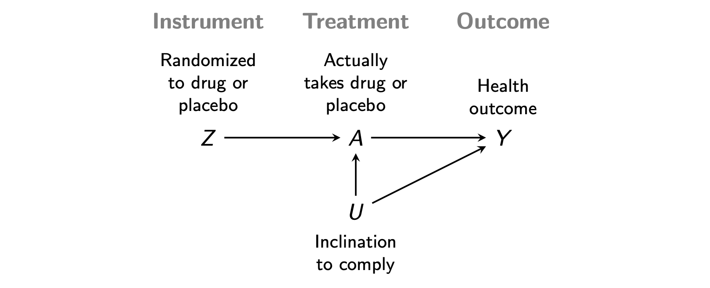

> Here are [slides](../slides/lec17_iv/lec17_iv.pdf).

Instrumental variables is a strategy to identify causal effects in the presence of unmeasured confounding. We illustrate instrumental variables through the example of a randomized controlled trial with noncompliance.

For a set of patients enrolled in a medical trial, let $Z$ indicate whether they are randomized to receive an experimental drug or a placebo. We will call $Z$ the **instrument**. Suppose that only some of the patients assigned the experimental drug actually take the drug. Let $A$ be the **treatment**: whether they take the drug. We are interested in the causal effect of the drug on a health outcome $Y$, which may also be shaped by unmeasured variable $U$ that cause compliance with the randomized treatment. The DAG below visualizes this causal structure.

Instrumental variables is a strategy to learn the causal effect of the drug ($A\rightarrow Y$) despite the unmeasured confounding $A\leftarrow U\rightarrow Y$. Two key facts about the DAG are essential.

1. **Exchangeability.** The instrument $Z$ is exchangeable with respect to the potential outcomes under each instrument value.
$$Z⫫ \{Y^{z=1},Y^{z=0}\}$$
     * This assumption holds when the only open paths between $Z$ and $Y$ are causal paths.
2. **No direct effect.** The instrument $Z$ affects the outcome $Y$ only through the treatment $A$.
     * This assumption holds when the only causal paths from $Z$ to $Y$ include the treatment $A$.

For estimation purposes, we also need

* A **strong instrument**: the effect of $Z$ on $A$ is large. Intuitively, if almost no one complies with our randomization, the effect estimate will be poor.
* **Monotonicity**: No one assigned to the placebo can find another way to get the treatment. Formally, the effect of $Z$ on $A$ may be positive or negative, but not positive for some people and negative for others.

Under these assumptions, IV allows inference by estimating:

1. The effect of $Z$ on $Y$
2. The effect of $Z$ on $A$
3. Then estimate the effect of $A$ on $Y$ by (1) / (2).

In class, we will discuss the intuition behind this approach to identification and estimation, and how to reason about its plausibility in various settings.

